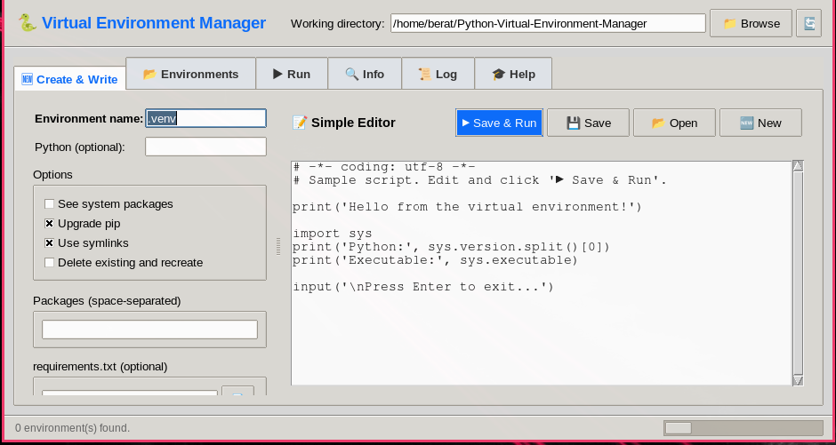

# 🐍 Python Virtual Environment Manager

A single-file, Tkinter-based GUI application for managing Python virtual
environments on **Windows**, **Linux**, and **macOS**. It combines
environment creation, package installation, a lightweight code editor,
and a script runner — all in one window.


---

## ✨ Features

| Tab | What it does |
|-----|--------------|
| **🆕 Create & Write** | Left panel: create a virtual environment (name, packages, `requirements.txt`, options). Right panel: a simple built-in code editor. |
| **📂 Environments** | List all virtual environments in the working directory, delete them, or send them to the **Run** tab. |
| **▶ Run** | Select an environment and a `.py` file, then **Start** / **Stop** it. Live stdout/stderr output, plus a `stdin` input line for `input()` calls. |
| **🔍 Info** | Detailed info about an environment: Python version, size, activation command, installed packages. |
| **📜 Log** | Colored operation log with save/clear. |
| **🎓 Help Menu** | 8-topic venv guide (what it is, folder layout, commands, pip, requirements.txt, common errors, comparisons, Git usage). |

### Additional highlights
- ⚡ **Non-blocking UI** — long-running tasks (venv creation, pip installs, script execution) run in background threads.
- 🎨 **Color-coded output** — success, warning, error, info.
- 📝 **Built-in editor** with Tab = 4 spaces.
- ▶ **Run with one click** — "Save & Run" saves the buffer and immediately launches it in the current environment.
- ⌨ **Interactive stdin** — send lines to running scripts (works with `input()`).
- 🛑 **Proper stop** — on Windows, subprocesses are killed via `taskkill /T`; on Linux/macOS, `terminate()` then `kill()`.
- 🔒 **No third-party dependencies** — pure Python standard library.

---

## 🖥️ Requirements

- **Python 3.8+**
- **Tkinter** (usually shipped with Python)

### Platform notes

| Platform | Notes |
|----------|-------|
| **Windows 10 / 11** | Works out of the box with the official python.org installer. Tkinter is included by default. High-DPI scaling is enabled automatically. |
| **Linux (Debian/Ubuntu)** | Tkinter may be a separate package: `sudo apt install python3-tk python3-venv` |
| **Linux (Fedora)** | `sudo dnf install python3-tkinter` |
| **Linux (Arch)** | `sudo pacman -S tk` |
| **macOS** | Tkinter is bundled with python.org builds. If you use Homebrew Python, install `python-tk`: `brew install python-tk` |

> ⚠️ **Windows PowerShell users:** If activation is blocked by execution policy, run:
> ```powershell
> Set-ExecutionPolicy -Scope CurrentUser RemoteSigned
> ```

---

## 🚀 Installation

No installation is required. Just download `venv_manager.py` and run it.

### Option 1 — Direct download

```bash
git clone https://github.com/beraterkek121122/Python-Virtual-Environment-Manager.git
cd Python-Virtual-Environment-Manager
python main.py
